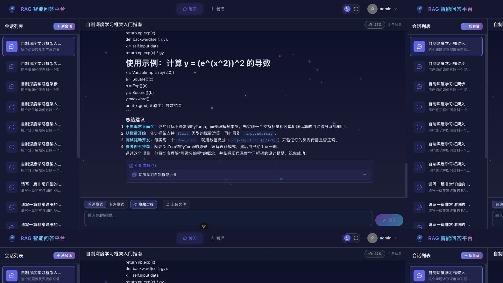
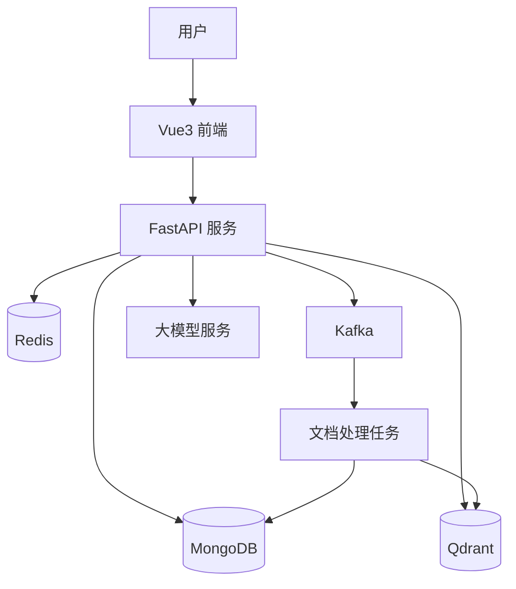
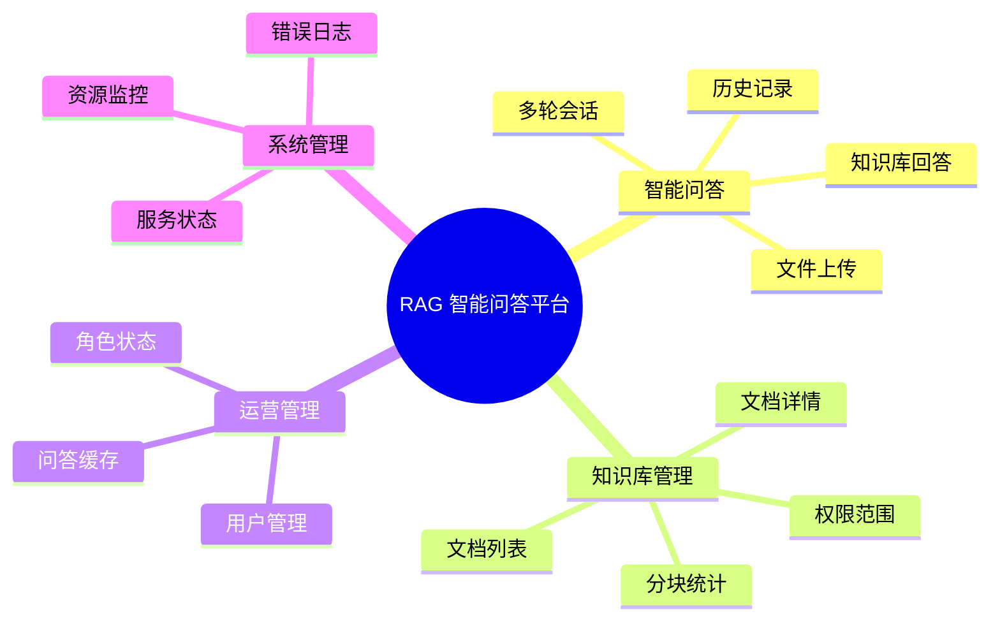
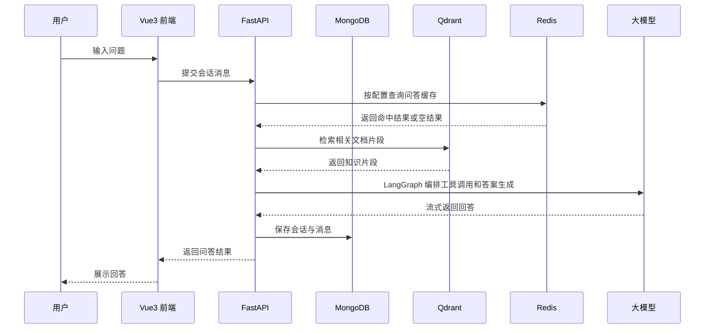
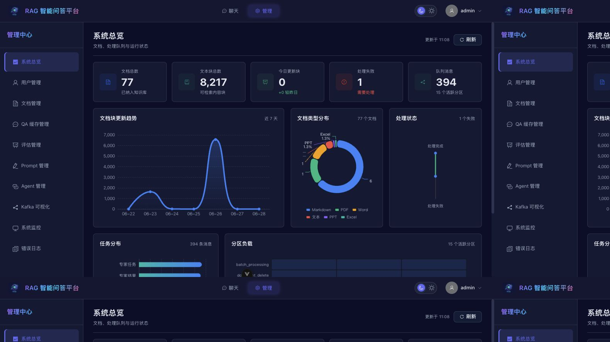
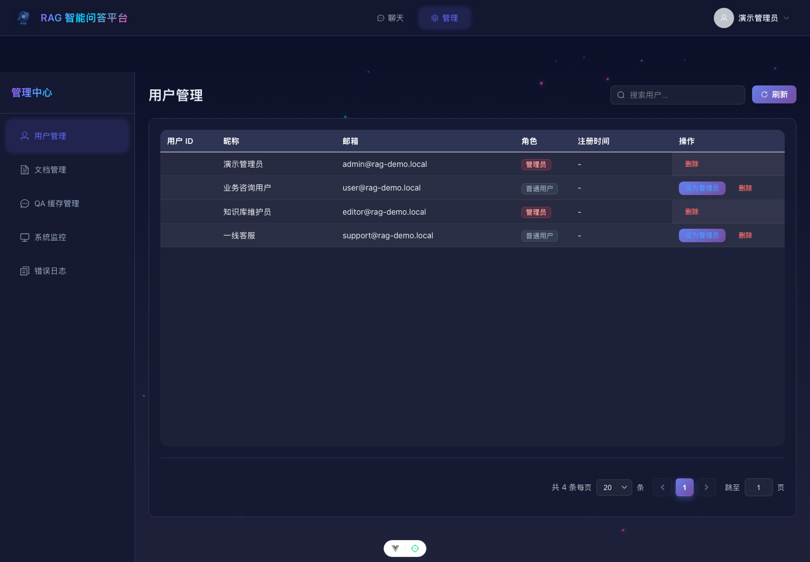
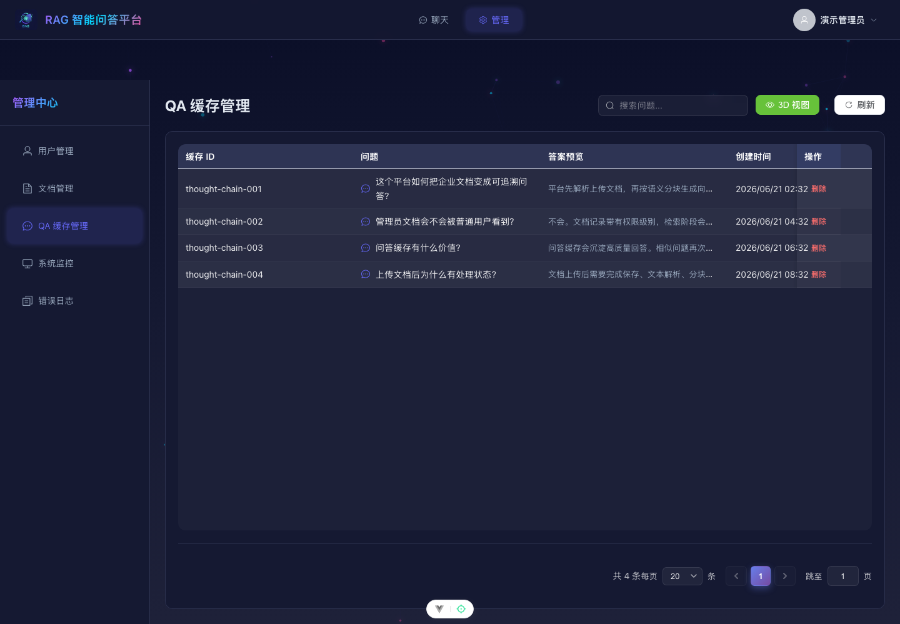
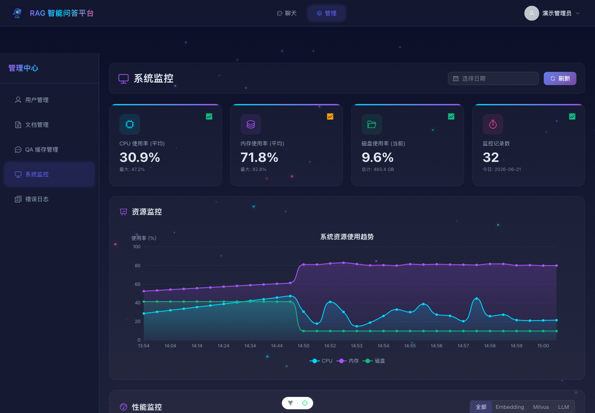

# RAG 智能问答平台

RAG 智能问答平台是一套面向企业知识库、内部制度问答、客服知识沉淀和文档检索的应用。系统包含登录、智能问答、文档管理、问答缓存、用户管理、系统监控和错误日志等功能，支持把业务资料整理成可查询、可追溯、可维护的知识服务。




## 技术栈

| 模块 | 技术 |
| --- | --- |
| 前端 | Vue 3、Vite、Pinia、Element Plus |
| 后端 | FastAPI、Beanie、Pydantic |
| 数据库 | MongoDB |
| 向量检索 | Qdrant |
| 缓存 | Redis |
| 消息队列 | Kafka |
| 模型服务 | Ollama / DeepSeek / 智谱 API |
| Agent 编排 | LangGraph |
| 部署依赖 | Docker、Docker Compose |

## 系统架构图



## 功能图



## 数据流图



## 核心功能

- 智能问答：支持多轮会话、历史记录、文件上传和知识库回答。
- 过程展示：展示工具调用、工具返回、引用文档和最终回答。
- 文档管理：支持文档列表、处理状态、权限范围、分块数量和详情查看。
- 问答缓存：支持显式开启，用于沉淀高频问题和标准答案。
- 用户管理：支持用户查询、角色管理和状态管理。
- 系统总览：展示文档、文本块、处理状态、队列消息和趋势分布。
- 系统监控：展示 CPU、内存、磁盘、数据库状态和运行指标。
- 错误日志：展示异常记录、告警信息和日志详情。

## 页面展示

### 1 登录页


支持昵称密码登录和验证码登录。

演示账号：

- 管理员：演示管理员 / Demo@123456
- 普通用户：业务咨询用户 / Demo@123456

---

### 2 智能问答


功能：

- 多轮会话
- 文件上传
- 历史记录
- 引用知识库回答
- LangGraph 工具过程展示
- 最终回答流式输出

演示数据：

- 引用文档：深度学习自制框架.pdf
- 回答过程：工具调用、工具返回、文档引用

---

### 3 系统总览



支持：

- 文档总数
- 文本块统计
- 处理失败统计
- 队列消息统计
- 文档块更新趋势
- 文档类型和任务分布

---

### 4 用户管理



支持：

- 用户查询
- 角色管理
- 状态管理

演示数据：

- 管理员
- 普通用户
- 知识库维护员
- 客服

---

### 5 文档管理


支持：

- 文档列表
- 处理状态
- 权限范围
- 分块统计

演示数据：

- 用户：4
- 文档：4
- 分块：12
- 会话：3
- 问答缓存：4

---

### 6 问答缓存



支持：

- 高频问题查看
- 标准答案管理
- 命中次数统计
- 审核状态展示

演示数据：

- 问答缓存：4
- 质量评估：4
- 评估样例：3

---

### 7 系统监控



支持：

- CPU 状态
- 内存状态
- 磁盘状态
- MongoDB 状态
- 服务运行指标

---

### 8 错误日志


支持：

- 日志列表
- 日期筛选
- 级别统计
- 详情展开

---

### 9 文档详情


支持：

- 基础信息查看
- 文档内容摘要
- 权限范围查看
- 处理状态查看

## 快速启动

### 1. 启动基础服务

```bash
docker start rag-mongodb rag-qdrant rag-redis kafka zookeeper
```

如果本地还没有容器，可以使用项目中的 Docker Compose 配置启动对应服务。

### 2. 安装后端依赖

```bash
pip install -r requirements.txt
```

### 3. 导入演示数据

```bash
python3 scripts/seed_demo_data.py
```

该命令会重建本地 `rag_platform` 数据库。

### 4. 启动后端

```bash
uvicorn main:app --host 0.0.0.0 --port 8081
```

后端地址：

```text
http://127.0.0.1:8081
```

### 5. 启动前端

```bash
cd web/plantform_vue
npm install
npm run dev
```

前端地址：

```text
http://127.0.0.1:5173
```

## 项目亮点

### RAG 检索增强问答

支持文档上传、分块、向量化检索和知识问答。

### LangGraph Agent 编排

默认使用 LangGraph 管理工具调用、失败恢复、知识库结果汇总和最终回答输出。

### 流式回答与过程展示

最终回答按流式输出，工具调用、工具返回和引用文档展示在过程区，正式回答只保留用户可读内容。

### 问答缓存

问答缓存默认关闭，需要时可以显式开启，避免旧答案影响新回答。

### 权限控制

支持管理员和普通用户角色隔离，文档也可以按权限范围管理。

### 监控与日志

提供系统运行监控和异常日志查看，方便观察服务状态。

### 管理后台

用户、文档、缓存、监控和日志集中管理，适合知识库长期维护。

## 目录结构

```text
api/                         后端接口
internal/                    后端业务模块
scripts/                     数据初始化脚本
docs/screenshots/            页面截图
web/plantform_vue/           Vue3 前端
Kafka/                       Kafka 配置
requirements.txt             Python 依赖
```
